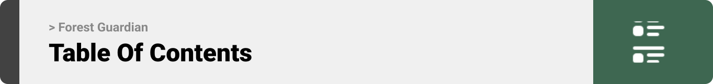
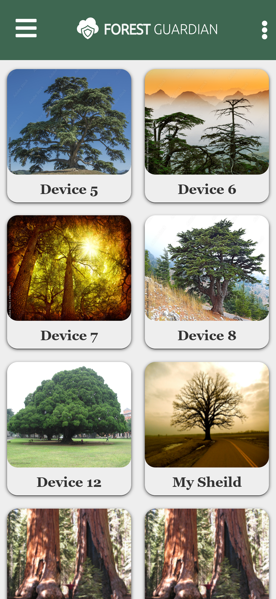

<!-- table of contents -->



<ul dir="auto">
<li><a href="#project-philosophy">Project Philosophy</a>
<ul dir="auto">
<li><a href="#user-types">User Types</a></li>
</ul>
</li>
<li><a href="#prototyping">Prototyping</a></li>
<li><a href="#implementation">Implementation</a></li>
<li><a href="#tech-stack">Tech Stack</a>

<li><a href="#how-to-run">How to Run</a>
<ul dir="auto">
<li><a href="#prerequisites">Prerequisites</a></li>
<li><a href="#installation">Installation</a></li>
</ul>
</li>
</ul>  


<br><br>


<ul dir="auto">
<li><a href="#Frontend">Frontend</a></li>
<li><a href="#Backend">Backend</a></li>
</ul>
</li>
<li><a href="#Demo">Demo</a></li>
<li><a href="#Performance">Performance</a></li>


<!-- project philosophy -->

<a id="project-philosophy"></a>
> A web app designed to be used on the mobile,the purpose of that app is to decrease the illegal logging to the forest using sound detection.
>
> The app notify the user by email about the type of the needed sound if its a chainsaw, a shotgun or axe stumping sound.

### User Stories
- As a user, I want to receive email notifications so I can stay informed about incidents of illegal logging and identify their types.
- As a user, I want the flexibility to add as many devices as needed to protect a larger area of trees effectively.
- As a user, I want a centralized location within the app to view and manage all my notifications, preventing them from getting lost in my email inbox.
- As a user,  I want to easily locate my devices on a map, ensuring they are not lost within the forest.

<br><br>

<!-- Prototyping -->

<a id="prototyping"></a>
> We designed Forest Guardian using wireframes and mockups, iterating on the design until we reached the ideal layout for easy navigation and a seamless user experience.

### Wireframes
| Devices Menu screen | Account Settings screen | SideMenu screen |Device Detail  | All screens GIF |
| ---| ---| ---| ---| ---|
|  |  |  |  |  |


### Mockups
| Add device screen | History screen | Main screen | side menu  | All screens GIF |
| ---| ---| ---| ---| ---|
|  |  |  |  |  |


<br><br>

<!-- Implementation -->

<a id="implementation"></a>
> Using the wireframes and mockups as a guide, we implemented the Forest Guardian app with the following features:

### User Screens (Mobile)
| Login screen | Main screen | Main screen (Dark) | Device screen | Map screen | All screens_______ |
| --- | --- | --- | --- | --- | --- |
|  |  |  |  |  |  |


<br><br>

<!-- Tech stack -->

<a id="tech-stack"></a>
###  Forest Guardian is built using the following technologies:

-This project leverages the MERN (MongoDB, Express.js, React, Node.js) stack for web development. Additionally, it incorporates TensorFlow.js for machine learning capabilities.


<br><br>

<!-- How to run -->

<a id="how-to-run"></a>
> To set up Forest Guardian locally, follow these steps:

### Prerequisites

This is an example of how to list things you need to use the software and how to install them.
* npm
  ```sh
  npm install npm@latest -g
  ```

### Installation
1. Clone the repo
   ```sh
   git clone https://github.com/HilalBodon/ForestGuardian.git
   ```
2. Install NPM packages
   ```sh
   npm install
   ```
3.Make your .env file and include your Email and password you want to notify from and the mongoDB connection string

Now, you should be able to run Forest Guardian and explore its features.
